# Getting Started HDRP

* [Overview](#overview)
* [Clone Toolkit Repository](#clone-toolkit-repository)
* [Create Unity Project](#create-unity-project)
* [Add Toolkit Folder](#add-toolkit-folder)
* [Add Inference Features](#add-inference-features)
* [Allow Unsafe Code](#allow-unsafe-code)
* [Install Barracuda Package](#install-barracuda-package)
* [Render Pipeline Setup](#render-pipeline-setup)
* [Add Volume Component](#add-volume-component)
* [Test it Out](#test-it-out)

## Overview

In this tutorial we will provide a basic demonstration of how to incorporate the [AIGamedevToolkit](https://www.intel.com/content/www/us/en/developer/articles/training/ai-gamedev-toolkit-tutorials.html) into a [Unity](https://unity.com/) project which uses the [High Definition Render Pipeline](https://docs.unity3d.com/Packages/com.unity.render-pipelines.high-definition@10.8/manual/index.html) (HDRP). By the end, you will know how to run a [deep learning](https://community.intel.com/t5/Blogs/Tech-Innovation/Artificial-Intelligence-AI/The-Difference-Between-Artificial-Intelligence-Machine-Learning/post/1335666) model inside a Unity HDRP scene, without any additional coding.

> **Note:** Please read this [introductory tutorial](https://github.com/IntelSoftware/AIGamedevToolkit/blob/main/Documentation~/Getting%20Started.md) before continuing.

## Clone Toolkit Repository

First, we need to clone the [GitHub repository](https://github.com/IntelSoftware/AIGamedevToolkit) for the toolkit. Make sure to actually clone the repository rather than downloading it as a `.zip`. Compressing the project folder can break some of the binary files included in the toolkit.

## Create Unity Project

Next, we need to create a HDRP project to use the toolkit. We can stick with the HDRP sample scene provided by Unity.

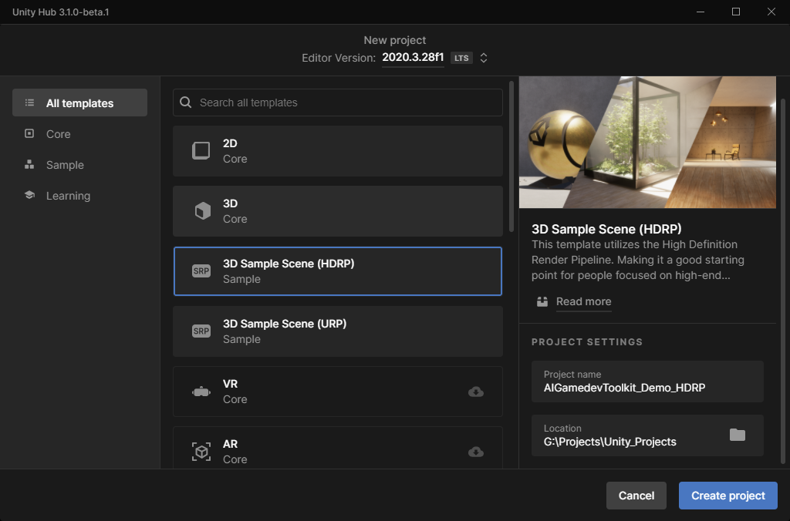

## Add Toolkit Folder

Once the Unity Editor has loaded, we can add the toolkit folder. Open the AIGamedevToolkit repository folder and select the `AIGamedevToolkit` subfolder.

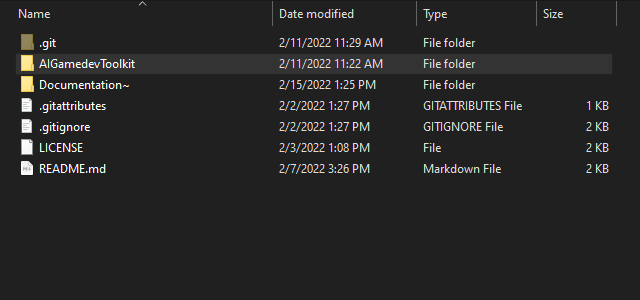

Drag the toolkit folder into the `Project → Assets` directory.

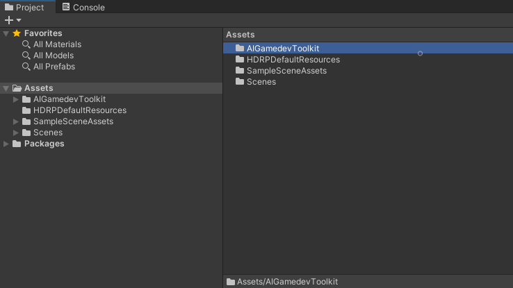

## Add Inference Features

As mentioned in the previous tutorial, the toolkit provides a graphical user interface (GUI) for adding inference features to a scene.

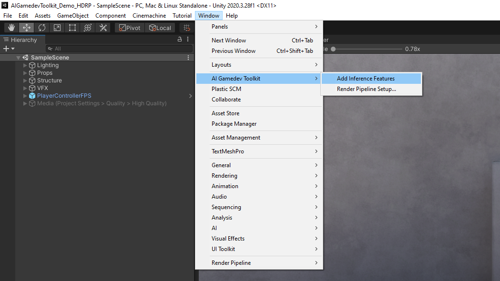

## Allow Unsafe Code

Once again, unsafe code needs to be enabled to use OpenVINO inference features.

Unsafe code can be enabled in the the Player Settings, just like when using the Built-in Render Pipeline.

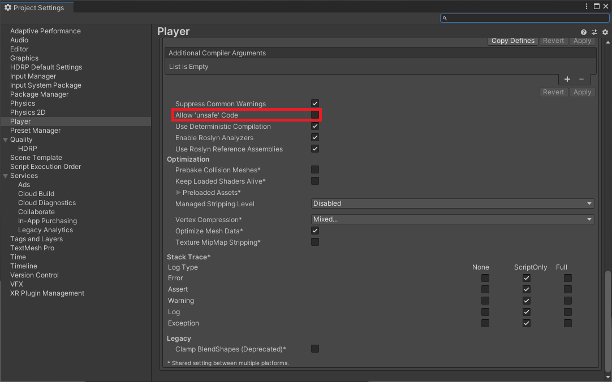

## Install Barracuda Package

Next, we will install the Barracuda package to enable the Barracuda inference features.

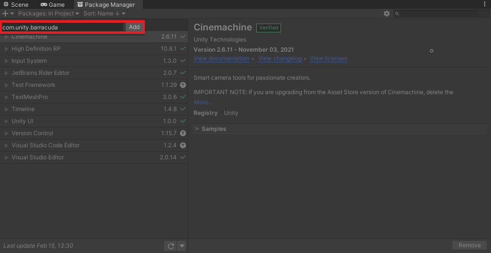

Back in the AIGamedevToolkit window, deselect the `COCO_YOLOX` inference feature and select the `StyleTransfer_Barracuda` option. Click on `Apply now` to add the inference feature to the scene.

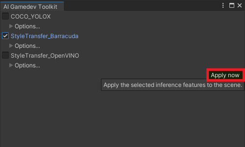

The toolkit makes some assumptions about the scene when adding inference features through the `AI Gamedev Toolkit` window.

## Render Pipeline Setup

We need to let the toolkit know which Render Pipeline we are using. Open the `AIGamedevToolkit` submenu and select `Render Pipeline Setup...`.

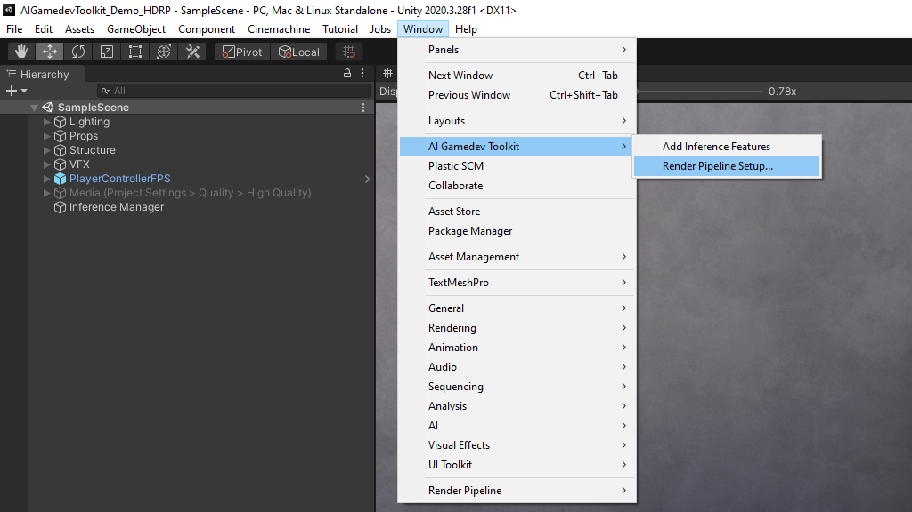

The toolkit will detect the current render pipeline and offer to perform the required configuration steps. Click `Yes` in the popup window to set up the toolkit for HDRP.

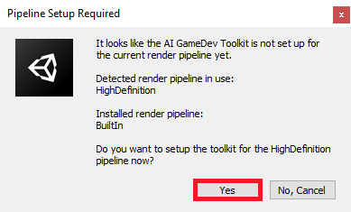

## Add Volume Component 

We can access the texture data for the current frame with a [custom volume component](https://docs.unity3d.com/Packages/com.unity.render-pipelines.high-definition@10.8/api/UnityEngine.Rendering.HighDefinition.CustomPostProcessVolumeComponent.html). The toolkit includes a preconfigured volume component called `HDRPTextureHelper`

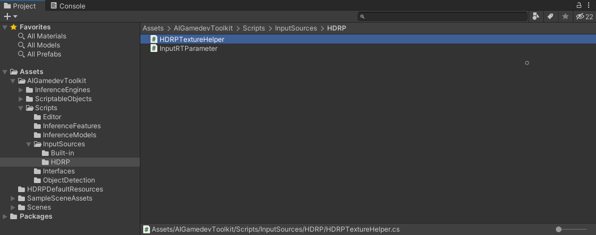

It provides the same functionality as the `CameraTextureHelper.cs` script used for the Built-in Render Pipeline.

We need to add this volume component to the `Default Volume Profile Asset` in the Project Settings.

Open the Project Settings folder and select the `HDRP Default Settings` submenu.

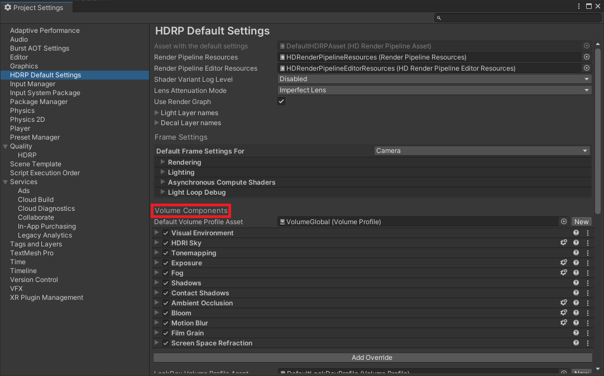

> **Note:** In Unity 2021, the HDRP settings are located at `Project Settings > Graphics > HDRP Default Settings`
>
> 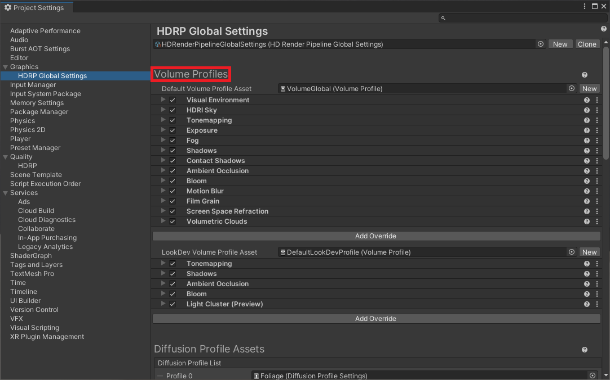

Click on the `Add Override` button under the `Default Volume Profile Asset`.

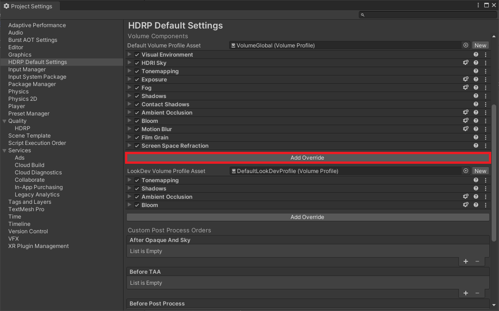

Type `HDRP` into the search box and select `HDRPTextureHelper`

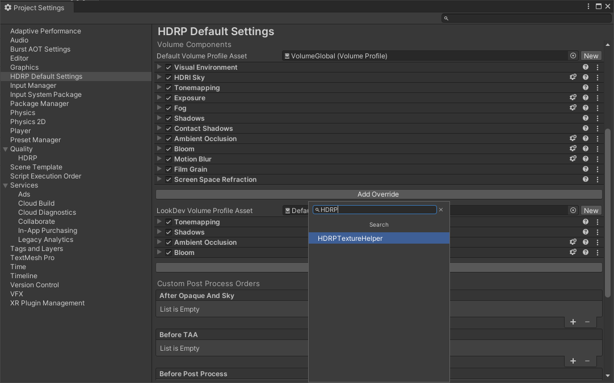

As with the `CameraTextureHelper.cs` script, the `HDRPTextureHelper` has a list of `InputRenderTexture `assets. Click on the toggle next to the `Input Textures Param` field to make it editable.

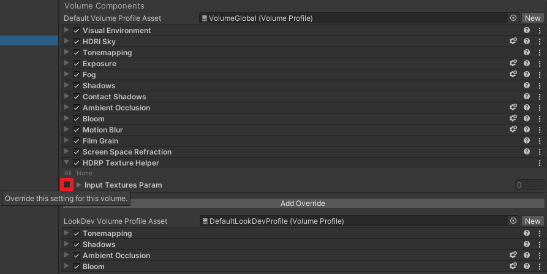

Open the `Input Textures Param` dropdown and click on the `+` sign.

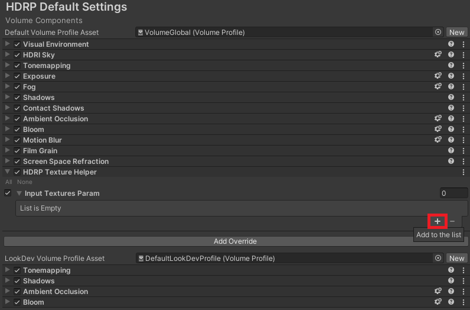

We can use the same `MainCamer_Texture` asset we used in the previous tutorial.

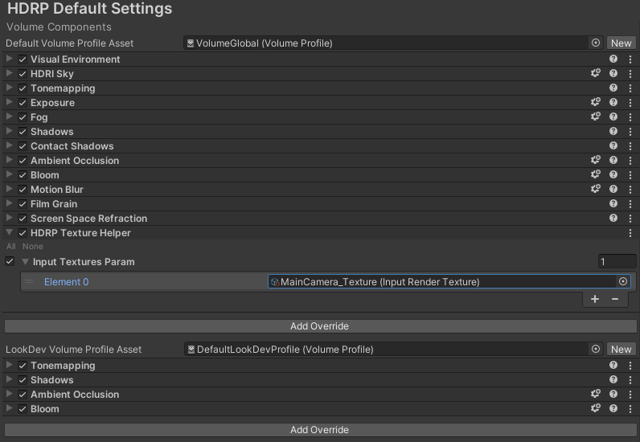

Scroll down to the `After Post Process` field and click on the `+` sign to add a new entry.

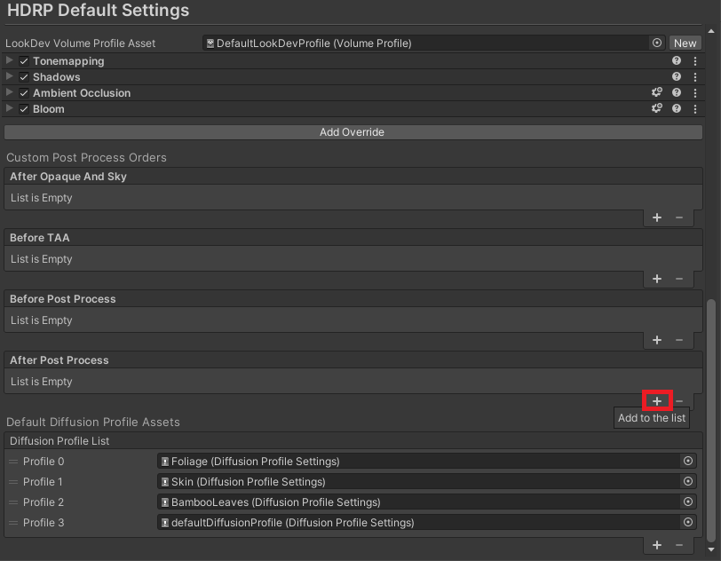

Select `AIGamedevToolkit.HDRPTextureHelper` from the available options.

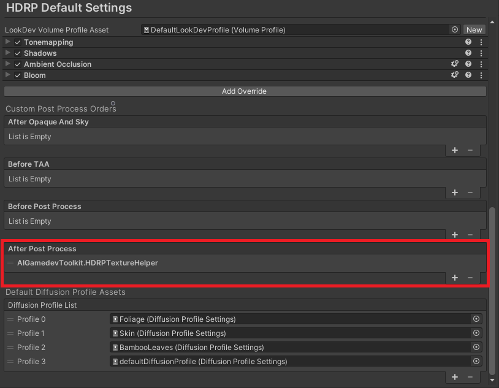

## Test it Out

Now we can press play to see the style transfer inference feature applied to the scene.

Additionally, the YOLOX inference feature can detect in-game objects.

